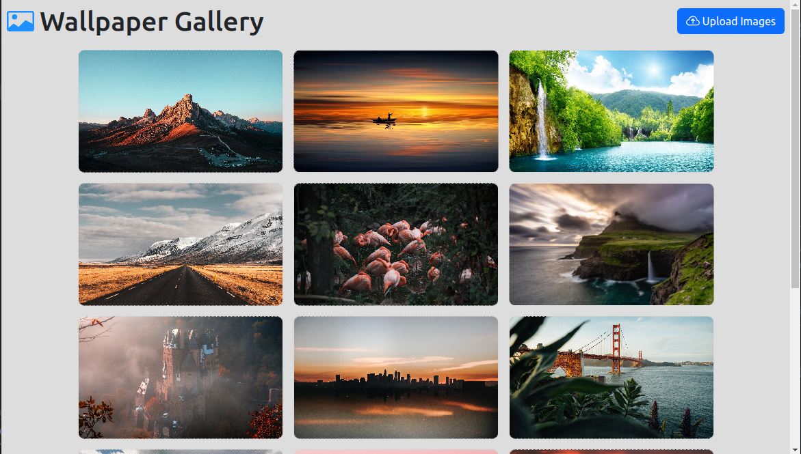
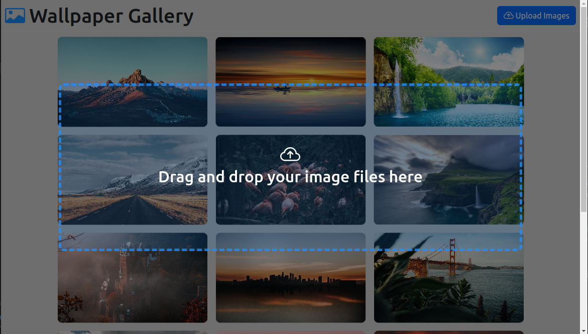
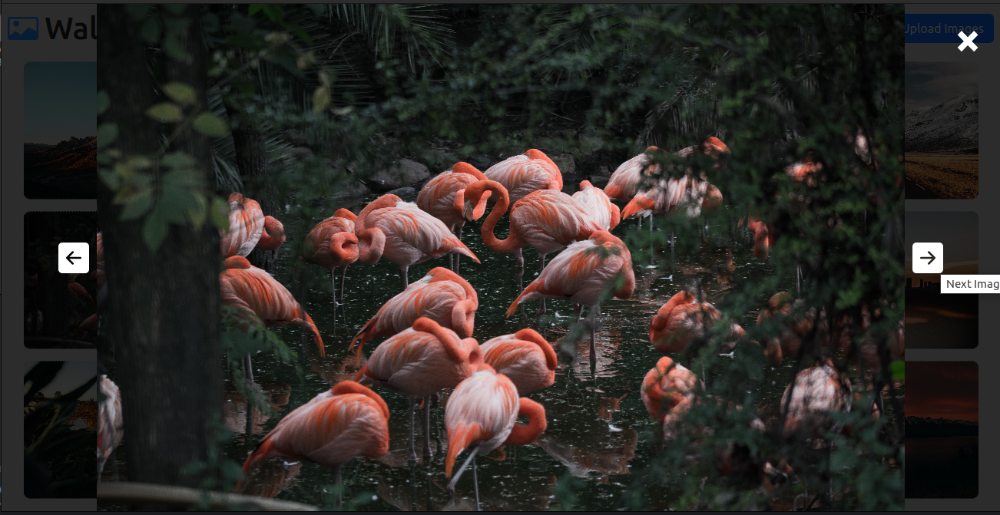

# <b>Wallpaper Gallery Application</b>

<p align="center">
    
</p>
<p align="center">
    
</p>
<p align="center">
    
</p>

<p>This is a simple web application created to use as a public wallpaper gallery. The application provides functionalities to download and upload images as per the user's desire.
This was developed as a fully responsive web application so that the users can use it in any device.
<br><br>
The main objective of this project was to get hands-on experience in  <b>HTML5 drag & drop API</b>, <b>FormData API in WEB API</b> and how to send jQuery AJAX requests to the back end with a <b>multipart body</b>.
</p>

## Technologies used
### Front-End
* HTML5
* SCSS
* CSS3
* EcmaScript
* ParcelJs
* CSS Loaders
* file-saver.js
* Web API (DOM API)
* jQuery
* jQuery AJAX

### Back-End
* Java 11
* Java SE 11
* Spring Framework (Spring Web MVC)
* CORS Filters

## How to use this repository

* Open the terminal
* Then use the below Git command to clone the repo
```
git clone https://github.com/SameeraWijerathne/public-image-gallery-app.git
```
Find the project link here: [Check the repository on GitHub](https://github.com/SameeraWijerathne/public-image-gallery-app.git)

<!-- CONTACT -->
## Follow me on LinkedIn

Sameera Wijerathne - [@LinkedIn](https://www.linkedin.com/in/sameerawijerathne/)